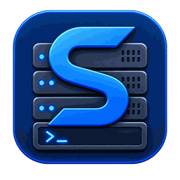

<p align="center">
  
</p>

<h1 align="center">ServerDesk</h1>

<p align="center">Quản trị máy chủ Linux trực quan trên Windows</p>

<p align="center">
  <a href="README.md">English</a> |
  <strong>Tiếng Việt</strong>
</p>

<p align="center">
  <a href="https://github.com/vianhofico/ServerDesk/actions/workflows/ci.yml"></a>
</p>

ServerDesk là ứng dụng desktop Windows để quản trị máy chủ Linux bằng giao diện trực quan, quen thuộc kiểu Windows, trong khi SSH/SFTP vẫn là lớp điều khiển bảo mật chính.

> Mô hình sản phẩm: **File Explorer + Task Manager + Services + Terminal + Docker Desktop + triển khai/quản trị server**, kèm optional realtime agent chạy qua SSH tunnel.

## Trạng thái — V1 đã hoàn thành

Roadmap M0–M8 đã được triển khai và certify trong repository. V1 bao gồm Windows client, quản trị agentless qua SSH, các phân hệ DevOps/deployment/administration/database/multi-server và backend/lifecycle của `serverdesk-agent` loopback-only tùy chọn.

Điều này **không có nghĩa** mọi Linux distro, mọi version database, mọi topology hay mọi tác vụ quản trị đều được hỗ trợ. ServerDesk chủ động fail-closed với capability chưa được chứng minh hoặc có rủi ro cao. Xem các tài liệu chính:

- [Scope hiện tại — đã làm gì, chưa làm gì](docs/CURRENT_SCOPE.vi.md)
- [Hướng dẫn sử dụng chi tiết theo từng phân hệ](docs/USER_GUIDE.vi.md)
- [Ma trận hỗ trợ/certification](docs/SUPPORT_MATRIX.vi.md)
- [Release notes V1.0.0](docs/releases/v1.0.0.vi.md)

## Điểm nổi bật của V1

- SSH profile an toàn với host-key trust, password/key/keyboard-interactive authentication, reconnect, proxy/bastion routing và connection history.
- Remote Explorer qua SFTP và remote editor có cơ chế lưu file an toàn.
- Terminal PTY thật và SSH forwarding local/remote/dynamic.
- Dashboard, processes, systemd services, storage, network/ports và logs.
- Docker Engine, exec diagnostics và Docker Compose v2 với validation YAML trước khi apply.
- Git helper cho vận hành và scheduled tasks.
- nginx, TLS/Certbot, environment file và deployment workflows.
- UFW/firewalld, users/groups/authorized keys, APT/DNF và backup/restore có audit.
- Database runtime/diagnostics và kết nối qua SSH tunnel cho PostgreSQL, MySQL, MariaDB, Redis, Microsoft SQL Server và MongoDB, với boundary certification riêng theo capability.
- Global dashboard, so sánh server và các thao tác metadata multi-server có guard.
- Optional `serverdesk-agent`: gRPC loopback-only qua SSH tunnel, realtime metrics/process/service/Docker/journal streams, signed artifact verification và backend install/update/status/uninstall đã review.

## Giới hạn quan trọng của V1

Các phần chưa thuộc certified V1 gồm Kubernetes, Podman, remote desktop đồ họa Linux, console AWS/Azure/GCP, database IDE/query console đầy đủ, chỉnh raw nftables, phân vùng/format filesystem có tính phá hủy, SysV-init certification và public/non-SSH agent management listener.

Riêng database: Redis backup/restore hiện Unsupported; MongoDB backup/restore chỉ certify cho standalone topology/version đã liệt kê; arbitrary SQL/Mongo shell execution nằm ngoài certified database scope. Version chính xác xem tại [`docs/SUPPORT_MATRIX.vi.md`](docs/SUPPORT_MATRIX.vi.md).

## Công nghệ/target

- Windows 11 x64 là client target đã certify; Windows 10 x64 là compatibility target khi dependency còn hỗ trợ.
- .NET 10 + WPF.
- Kiến trúc module Domain/Application/Infrastructure.
- SSH/SFTP/PTY là đường chính; optional agent không thay thế SSH trust boundary.
- SQLite lưu local metadata không chứa secret.
- Secret/credential đi qua secure-storage abstraction của Windows.
- `serverdesk-agent` chạy Linux, bind loopback và được truy cập qua SSH tunnel.

## Cấu trúc repository

```text
src/
  ServerDesk.App/                        # WPF client
  ServerDesk.Domain/                     # domain contracts/models
  ServerDesk.Application/                # use case và transport-neutral ports
  ServerDesk.Infrastructure.Persistence/ # SQLite/local persistence
  ServerDesk.Infrastructure.Ssh/         # SSH/SFTP/PTY/routing/agent transport
  ServerDesk.Infrastructure.Databases/   # database adapters đã certify
  ServerDesk.Platform.Windows/           # Windows platform/secret integration
  ServerDesk.Agent.Contracts/            # Protobuf contracts
  ServerDesk.Agent/                      # optional Linux agent host

tests/
  ServerDesk.Tests/
  ServerDesk.Ssh.IntegrationTests/

docs/
.github/
```

## Tài liệu

Dành cho người dùng:

1. [`docs/USER_GUIDE.vi.md`](docs/USER_GUIDE.vi.md) — cách sử dụng từng phân hệ.
2. [`docs/CURRENT_SCOPE.vi.md`](docs/CURRENT_SCOPE.vi.md) — capability đã làm, conditional, unsupported và out-of-scope.
3. [`docs/SUPPORT_MATRIX.vi.md`](docs/SUPPORT_MATRIX.vi.md) — platform/engine/version được certify chính xác.
4. [`docs/releases/v1.0.0.vi.md`](docs/releases/v1.0.0.vi.md) — release notes V1 đầu tiên.

Dành cho contributor/coding agent:

1. [`AGENTS.vi.md`](AGENTS.vi.md) — workflow phát triển bắt buộc.
2. [`docs/PRODUCT_PLAN.vi.md`](docs/PRODUCT_PLAN.vi.md) — định hướng sản phẩm và mô hình UX.
3. [`docs/ROADMAP.vi.md`](docs/ROADMAP.vi.md) — contract/lịch sử milestone M0–M8.
4. [`docs/SECURITY_RULES.vi.md`](docs/SECURITY_RULES.vi.md) — ràng buộc bảo mật.
5. [`docs/TEST_STRATEGY.vi.md`](docs/TEST_STRATEGY.vi.md) — test/certification strategy.
6. [`docs/UX_RULES.vi.md`](docs/UX_RULES.vi.md) — quy tắc UI/UX.

## Build từ source

```powershell
dotnet restore ServerDesk.sln
dotnet build ServerDesk.sln -c Release
```

WPF build chính chạy trên Windows. Release workflow publish package `win-x64` self-contained chỉ sau khi CI của đúng commit trên `main` xanh.

## Mô hình bảo mật trong một câu

ServerDesk ưu tiên SSH trust chuẩn, tách secret khỏi profile metadata thông thường, coi remote capability là dữ liệu cần kiểm chứng, và yêu cầu preview/confirm/verify cho mutation rủi ro thay vì blind retry khi trạng thái không chắc chắn.
